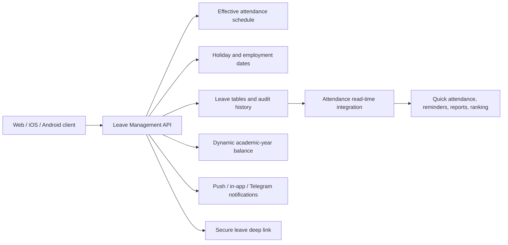
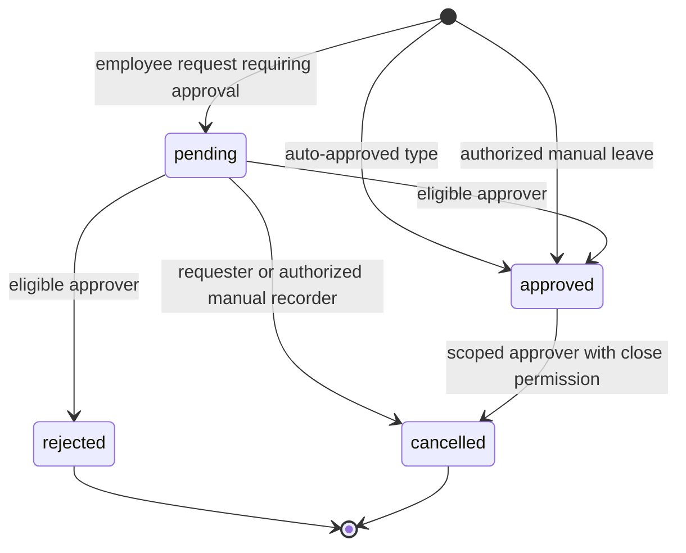

# Leave Management — End-to-End Developer Guide

This document is the engineering contract for leave in PAMAIS. It covers employee leave requests, manual staff leave, approvals, balances, proof images, replacements, cancellations, policy deductions, attendance integration, notifications, privacy, and reporting. A developer should be able to build a web, iOS, Android, or admin client from this guide without copying business rules into the client.

The authoritative API prefix is:

```text
/api/v1/leave-management
```

All API endpoints in this guide require an authenticated active employee unless explicitly stated otherwise.

## 1. Non-negotiable rules

1. The API is the authority for identity, time, schedule, balance, overlap, permission, status transitions, and attendance coverage.
2. Clients may preview and disable invalid controls, but must never be trusted to enforce a leave rule.
3. An employee may have multiple pending requests when their dates do not conflict and reserved balance remains available.
4. Pending requests reserve allowance. They do not count as taken leave until approved.
5. Approved leave reduces the balance and affects attendance. Pending, rejected, and cancelled leave do not affect attendance.
6. Full-day leave covers every scheduled session on that date. Session leave covers only its stored 1-based session indexes.
7. Any pending or approved leave on a date blocks another request for that date. Do not create separate overlapping requests for other sessions on the same date.
8. Leave is integrated with attendance at read and validation time. Never insert fake attendance records for leave.
9. Admin role alone does not grant leave-decision authority. Approval requires an active `leave_approvers` assignment.
10. No one may approve their own request.
11. `can_view_all_requests` is visibility only. It never expands decision, manual-entry, balance-adjustment, or cancellation authority.
12. `can_create_for_staff`, `can_adjust_leave_balance`, and `can_cancel_approved_leave` are independent privileges.
13. An approver with `can_approve_all = false` and no branch or department has no decision scope. An empty scope must never become school-wide access.
14. Manual leave is immediately approved, fully audited, and transactional across the whole employee batch.
15. A balance policy deduction is not leave. It must not create a leave request, leave date, or attendance effect.
16. Cancellation changes status; it does not delete history. Dynamic balance calculation restores the applicable allowance automatically.
17. Cambodia calendar rules use `Asia/Phnom_Penh` (`UTC+07:00`). Stored audit timestamps are UTC.
18. Every mutation must be safe under retries and concurrency. Side-effect failure after commit must not make the client resubmit a saved mutation.

## 2. Architecture



The client owns presentation and temporary form state. The API owns all final decisions.

## 3. Terminology

- **Leave type**: Annual, sick, personal, or another configured category.
- **Allocation**: Days available for one leave type in one academic year.
- **Displayed remaining**: Allocation minus approved leave and active policy deductions.
- **Available to request**: Displayed remaining minus pending leave reservations.
- **Day cost**: Balance amount charged for one selected date.
- **Employee request**: Leave submitted by the employee; pending unless its type auto-approves.
- **Manual leave**: Immediately approved leave entered by an authorized approver for another employee.
- **Policy deduction**: An audited allowance reduction that has no leave date and no attendance effect.
- **Decision scope**: The approver's branch and/or department, or explicit school-wide approval.
- **Read-only viewer**: An approver with `can_view_all_requests` who cannot decide a particular request.
- **Replacement**: An active colleague proposed or assigned to cover work.

## 4. Data model

### `leave_types`

Important fields:

- `name`, `description`
- `max_days_per_year`: fallback when no academic allocation exists
- `is_paid`
- `requires_approval`
- `requires_proof`
- `is_active`
- `display_order`, `color_hex`

A type referenced by any request cannot be deleted. Deactivate it instead so historical rows remain readable.

### `leave_type_allocations`

One row per `(leave_type_id, academic_id)` with `allocated_days`. This pair is unique. An active row overrides the leave type's fallback maximum.

### `leave_requests`

The request header stores:

- employee, leave type, first and last selected dates
- `status`: `pending`, `approved`, `rejected`, or `cancelled`
- approver and decision timestamp
- academic allowance bucket captured at creation
- total fractional day cost
- reason, proof path, replacement, and replacement note
- creator and `creation_source`: `employee` or `manual`
- review-reminder count and timestamp
- cancellation actor, timestamp, and reason

### `leave_request_days`

The authoritative per-date breakdown stores:

- `leave_date`
- `scope`: `full_day` or `sessions`
- `session_indexes`: 1-based indexes; null for full day
- `sessions_total`: schedule snapshot at creation
- `day_cost`
- `time_from`, `time_to`: display snapshots

Do not recalculate historical cost from today's schedule. The stored snapshots preserve what was approved.

### `leave_approvers`

An active assignment contains:

- optional branch and department scope
- `can_approve_all`
- `can_view_all_requests`
- optional `max_days_can_approve`
- `can_create_for_staff`
- `can_adjust_leave_balance`
- `can_cancel_approved_leave`
- active state

### `leave_balance_adjustments`

Stores audited policy deductions separately from requests:

- employee, leave type, academic year
- positive deduction amount
- effective date and reason
- creator
- `active` or `voided`
- void actor, reason, and time

### `leave_histories`

Append-only request audit events include creation, manual creation, approval, rejection, reminder, and cancellation with old/new status, actor, notes, and UTC timestamp.

The legacy `leave_balances` and `leave_policies` models are not the source of the current dynamic balance calculation.

## 5. Status state machine



There is no transition out of `rejected` or `cancelled`. Correction is performed by creating a new request. The first valid approver decision wins because the request row is locked.

## 6. Academic years and balance formulas

### Active academic year

The server resolves the active academic year from `academic.status = 1`, then falls back to `settings.academicid`. If neither is valid, balance-dependent operations fail clearly.

### Allocation

```text
allocated = active allocation row for type/year
            or leave_type.max_days_per_year
```

### Employee balance response

```text
taken = SUM(day_cost where status = approved)
pending = SUM(day_cost where status = pending)
policy = SUM(active policy deductions)

remaining_days = max(0, allocated - taken - policy)
available_to_request_days = max(0, remaining_days - pending)
```

`remaining_days` describes entitlement after approved usage. Use `available_to_request_days` in a request form because pending requests already reserve part of that entitlement.

New clients must read `available_to_request_days`. For compatibility with an older API, derive `max(0, remaining_days - pending_days)` when the field is absent.

### As-of reports

Admin balance reports apply approved leave and active policy deductions only on or before `as_of_date`. Pending is returned separately and does not reduce the report's `remaining_days`.

### Employee request academic bucket

Self-service requests always charge the currently active academic allowance. This keeps employee submission available for newly opened future terms without requiring an academic-year switch.

### Manual leave academic bucket

Manual leave has three modes:

1. Explicit `academic_id`: charge that configured year; keep selected leave dates unchanged.
2. `use_active_academic_year = true`: charge the active year; keep dates unchanged.
3. Neither: infer the one configured academic year containing the whole date range.

In inferred mode, a range spanning two academic years must be split. An explicit bucket is an audited administrative correction and may intentionally differ from the leave dates.

## 7. Permission matrix

| Capability | Required authority |
|---|---|
| Read active leave types | Any active employee |
| Create own request | Any active employee |
| Read own balances/history | Request owner |
| Read one request | Owner, replacement, admin, in-scope approver, view-all reviewer, or recorded decision approver |
| View school leave setup | Admin role |
| Change types, allocations, approvers | Admin role |
| Decide a pending request | Active approver, matching decision scope, within day limit, not owner |
| View all requests read-only | Active approver with `can_view_all_requests` |
| Record staff leave | Active approver with `can_create_for_staff` and matching scope |
| Deduct staff balance | Active approver with `can_adjust_leave_balance` and matching scope |
| Cancel own pending request | Request owner |
| Cancel another manual pending row | Authorized manual recorder in scope |
| Close approved leave | Active approver with `can_cancel_approved_leave`, matching scope and day limit |
| Export balances | Admin role |

Important details:

- Admin can inspect requests but cannot approve without an approver assignment.
- Original approval does not grant later close permission.
- Request ownership does not grant cancellation of approved leave.
- `can_approve_all` is the only implicit school-wide decision scope.
- With `can_approve_all = false`, at least branch or department must match for decision authority.
- A no-scope view-all assignment is a valid school-wide read-only reviewer.
- Feature locks add write restrictions; they never grant leave authority.

## 8. Employee request flow

### Step 1: Load configuration

Load these in parallel:

- `GET /leave-types`
- `GET /me/balances`
- relevant `GET /me/requests` range for calendar markers

Show active leave types in API `display_order`. Use `available_to_request_days` in the form. Show pending separately so the employee understands reserved allowance.

Do not disable the entire form merely because another request is pending. Block only overlapping dates and enforce the available balance.

### Step 2: Select dates

Self-service rules:

- at least one date
- no past date in Cambodia time
- earliest-to-latest span no greater than 310 days
- selected dates may be non-contiguous
- a date already used by pending or approved leave is unavailable

### Step 3: Preview the effective schedule

Call:

```http
POST /api/v1/leave-management/requests/preview
Content-Type: application/json

{
  "start_date": "2026-08-10",
  "end_date": "2026-08-12"
}
```

Each day returns working state, holiday information, effective sessions, overlap state, and covered session indexes. The schedule includes configured attendance exceptions; clients must not infer sessions from weekday alone.

### Step 4: Choose full day or sessions

For each selected working date:

- Full day costs `1.0`.
- Specific sessions cost `selected_count / sessions_total`.
- Session indexes are 1-based.
- At least one index is required for session scope.
- Indexes must exist in that day's preview.
- Selecting all sessions is normalized by the API to full day.

Examples for a two-session date:

| Selection | Stored scope | Cost |
|---|---|---:|
| Full day | `full_day` | 1.0 |
| Session 1 | `sessions: [1]` | 0.5 |
| Session 2 | `sessions: [2]` | 0.5 |
| Sessions 1 and 2 | `full_day` | 1.0 |

### Step 5: Optional replacement

Use `GET /colleagues`. The replacement must be active and cannot be the requester. The employee proposes a replacement; the approver may keep, replace, or clear it.

### Step 6: Proof images

Every leave type may include proof. Upload each selected image first with the
multipart field `file`; leave types with `requires_proof` must include at least
one image, while all other types may submit with or without proof:

```http
POST /api/v1/leave-management/requests/proof
Content-Type: multipart/form-data
```

Server validation:

- JPEG, PNG, or WebP only
- maximum 5 MB per file
- decoded image must match declared content type
- maximum 25 million pixels
- server-generated user-prefixed UUID filename

Send the returned path in `proof_image_path`. Multiple current mobile proofs are comma-separated. Never accept an arbitrary client path as evidence in a new implementation.

### Step 7: Submit

```http
POST /api/v1/leave-management/requests
Content-Type: application/json

{
  "leave_type_id": 2,
  "reason": "Medical appointment",
  "replacement_user_id": 81,
  "proof_image_path": "/uploads/leave_proofs/u54_example.jpg",
  "days": [
    {
      "leave_date": "2026-08-10",
      "scope": "sessions",
      "session_indexes": [2]
    },
    {
      "leave_date": "2026-08-11",
      "scope": "full_day"
    }
  ]
}
```

Do not send employee id, total cost, schedule count, time windows, status, or academic year. The API derives them.

### Server validation order

The server:

1. locks and validates the active employee row;
2. validates non-empty reason;
3. validates active leave type;
4. sorts days and rejects duplicate dates;
5. resolves active academic allowance;
6. rejects past dates and excessive span;
7. rejects any date already covered by pending/approved leave;
8. rejects holidays and non-working days;
9. resolves the employee's effective sessions for each date;
10. validates and normalizes session selection;
11. calculates authoritative fractional cost;
12. calculates available balance including pending reservations and policy deductions;
13. validates replacement;
14. validates proof ownership and requirement;
15. creates pending or auto-approved request and day rows;
16. appends audit history in the same transaction;
17. serializes a valid response and commits;
18. invalidates cache and schedules notifications after commit.

## 9. Manual staff leave

Manual leave is for historical corrections or approved leave entered on another employee's behalf. It is not a shortcut around scope or balance.

### Required authority

The actor needs:

- an active `leave_approvers` row;
- `can_create_for_staff = true`;
- school-wide approval or a matching branch/department scope;
- an unlocked `record_staff_leave` mutation feature, unless the actor is an allowed super-admin override.

The actor cannot create manual leave for themselves.

### Recommended client sequence

1. `GET /admin/manual-leave/employees` to select in-scope active employees.
2. `GET /admin/manual-leave/academic-years` to show allowance buckets.
3. `POST /admin/manual-leave/balances` for authoritative batch balance context.
4. `POST /admin/manual-leave/preview` for each target whose schedule must be shown.
5. Let the actor select leave type, dates, full-day/session coverage, year, and reason.
6. Confirm employee count, cost, allowance bucket, and immediate approval.
7. `POST /admin/manual-leave` once.
8. Refresh request lists, employee balance, and attendance reports.

### Employee search

`GET /admin/manual-leave/employees` supports branch, department, nationality category, comma-separated ids, text search, page, and limit. The server always intersects client filters with the actor's scope and excludes the actor.

### Balance context

```http
POST /api/v1/leave-management/admin/manual-leave/balances
Content-Type: application/json

{
  "user_ids": [54, 81],
  "start_date": "2026-07-01",
  "end_date": "2026-07-03",
  "academic_id": 16,
  "use_active_academic_year": false
}
```

This response subtracts approved, pending, and active policy deductions so it matches creation-time availability.

### Preview

```http
POST /api/v1/leave-management/admin/manual-leave/preview
Content-Type: application/json

{
  "user_id": 54,
  "start_date": "2026-07-01",
  "end_date": "2026-07-03"
}
```

Past dates are allowed. Holiday, working-day, schedule-exception, overlap, and employment-boundary information is returned.

### Create

```http
POST /api/v1/leave-management/admin/manual-leave
Content-Type: application/json

{
  "user_ids": [54, 81],
  "leave_type_id": 1,
  "start_date": "2026-07-01",
  "end_date": "2026-07-03",
  "academic_id": 16,
  "reason": "Approved historical correction",
  "days": [
    {
      "leave_date": "2026-07-01",
      "scope": "full_day"
    }
  ],
  "use_active_academic_year": false
}
```

Rules:

- 1–50 unique employee ids per mutation
- past and future dates allowed
- actor excluded
- all employees active and in scope
- active leave type required
- reason required, maximum 1000 characters
- selected span maximum 310 days
- explicit day dates must be unique and inside the range
- any pending/approved conflict blocks the employee/date
- holidays, non-working days, and dates outside employment are not charged
- if no explicit `days` are sent, every scheduled working date becomes full-day leave
- every target must produce at least one charged working date
- balance includes approved, pending, and policy reservations
- manual permission is separate from `max_days_can_approve`; the approval-inbox day limit does not constrain manual creation
- leave becomes `approved` immediately with creator and approver audit data
- proof is optional for every leave type and mandatory when `requires_proof` is enabled; a batch shares the uploaded proof across its created requests
- no replacement is collected by the current manual endpoint
- the entire batch commits or rolls back; partial success is forbidden

If batch employees have different session schedules, preview each employee. A shared session-index selection that is invalid for any target causes the entire batch to fail.

## 10. Approval and review

### Inbox

Use `GET /admin/requests`. It supports status, academic year, active-year-only, employee, date range, date basis, limit, and offset.

Date bases:

- `leave`: request date overlap
- `submitted`: request creation time
- `decision`: approval/rejection/cancellation activity time

Pending UI should normally use `submitted`; processed UI should use `decision`. Cambodia calendar-day filters are converted to UTC boundaries by the API.

Each row includes request-specific `can_decide`, `can_cancel`, and reasons. Render controls from these fields, but expect the mutation endpoint to recheck everything.

### Actionability

`GET /requests/{id}/actionability` is useful before routing a deep link. It returns view, decision, and cancellation authority for the signed-in account.

### Decision

```http
POST /api/v1/leave-management/requests/123/decision
Content-Type: application/json

{
  "action": "approve",
  "note": "Approved",
  "replacement_user_id": 81,
  "replacement_note": "Cover afternoon class"
}
```

Rules:

- request must still be pending;
- actor cannot be requester;
- active approver assignment required;
- branch/department scope must match, or `can_approve_all` must be true;
- total cost must be within `max_days_can_approve` when configured;
- rejection requires a reason;
- replacement `null`/omitted keeps the proposal, `0` clears it, positive id sets it;
- row lock ensures the first decision wins;
- a later decision receives an already-handled error naming the decider when available.

### Review reminders

`POST /requests/{id}/review-reminder` is available to the requester or a read-only all-request reviewer who cannot decide the row.

- Request must be pending.
- At least one active, in-scope, within-limit decision maker must exist.
- The sender cannot use a reminder instead of deciding when they can decide directly.
- After the first sent reminder, wait 15 minutes.
- After later reminders, wait one hour.
- A cooldown response is `429` with code, retry seconds, and absolute next time.
- Approver contact details are not disclosed to the employee requester.

## 11. Cancellation and balance restoration

Call `POST /requests/{id}/cancel` with:

```json
{
  "reason": "Schedule changed"
}
```

Rules:

- owner may withdraw their own pending request;
- a pending request cannot be cancelled after its first requested leave date has passed in Cambodia time; it must remain available for review;
- admin may cancel pending requests under the current actionability policy;
- an authorized in-scope manual recorder may cancel a manual pending legacy row;
- approved leave requires an active approver assignment with `can_cancel_approved_leave`, matching scope, and matching approval day limit;
- admin role, request ownership, or being the original approver does not bypass approved-close permission;
- rejected and already-cancelled requests cannot be cancelled;
- a reason is mandatory for manual leave or when closing another employee's approved leave;
- cancellation status, audit fields, proof reference removal, and history commit in one transaction;
- proof storage deletion occurs after the database commit;
- dynamic balance immediately stops counting cancelled day rows;
- attendance immediately stops treating the sessions as approved leave; no attendance rows require cleanup.

## 12. Policy balance deductions

Use a policy deduction when allowance must be reduced without asserting that the employee was absent on a particular date.

Required authority is `can_adjust_leave_balance` plus matching scope. The actor cannot adjust their own balance.

Flow:

1. `GET /admin/balance-adjustments/employees`
2. `POST /admin/balance-adjustments/context`
3. Confirm type, positive amount, selected employees, and reason
4. `POST /admin/balance-adjustments`
5. Read history with `GET /admin/balance-adjustments`
6. Correct an error with `POST /admin/balance-adjustments/{id}/void`

Create example:

```json
{
  "user_ids": [54, 81],
  "leave_type_id": 1,
  "amount_days": 0.5,
  "reason": "Policy deduction reference HR-2026-08"
}
```

Rules:

- 1–50 employees
- active academic year only
- active leave type
- positive amount, at most 365 days
- reason 3–1000 characters
- amount cannot exceed `allocated - approved - pending - active deductions`
- entire batch is row-locked and transactional
- effective date is current Cambodia date
- adjustment never changes attendance
- voiding preserves the original row and restores the balance

## 13. Attendance integration

Approved leave is loaded from `leave_requests` joined to `leave_request_days`.

```text
full_day -> all sessions covered
sessions -> only stored 1-based indexes covered
```

Attendance behavior:

- Quick attendance marks covered sessions `on_leave` and does not ask for check-in/out.
- A direct check-in to a covered session is rejected as not required.
- An uncovered later session remains actionable.
- Reminder jobs skip covered sessions.
- Detailed reports show `on_leave` instead of missing/absent for covered sessions.
- Full-day leave is excused, not present and not absent.
- Partial leave can coexist with real attendance in uncovered sessions.
- Ranking and absence totals exclude approved leave according to their documented formulas.
- Pending, rejected, and cancelled requests are ignored.
- Cancellation takes effect through the next read because no synthetic attendance row exists.

See [Attendance System — End-to-End Developer Guide](./attendance_dev_guide.md) for the full attendance state machine.

## 14. Privacy and list visibility

`GET /active-upcoming` is not an unrestricted staff directory.

- Admin and explicit school-wide/view-all approvers can see pending and approved rows.
- Scoped approvers can see pending and approved rows in scope.
- Ordinary staff see approved colleagues in their own branch.
- Ordinary staff without a branch see only their own leave.
- Private colleague reason, proof, decision note, cancellation reason, and replacement note are redacted for ordinary staff.
- A request detail endpoint independently rechecks view permission.

Phone numbers and decision contacts are only included where the endpoint and viewer role require them. Do not persist a request response in a shared browser cache.

## 15. Notifications and deep links

Post-commit notification flows include:

- new pending request -> eligible approvers
- auto-approved request -> eligible approvers and replacement
- manual leave -> affected employee
- review reminder -> eligible decision makers
- approval/rejection -> requester, other eligible approvers, and replacement on approval
- cancellation -> eligible approvers, owner when another actor cancelled, and replacement
- policy deduction/void -> affected employee
- optional Telegram message according to attendance notification settings and branch routing

Mobile routes:

- approver inbox: `leave_requests`
- employee history: `employee_leave`

Public Telegram links use `/leave/{request_id}` only as a safe app-launch page. The page contains no leave data. It launches `pamais://leave/{id}` or the Android intent, then the authenticated app calls actionability/detail APIs. A web implementation must follow the same rule: an id in a URL is never authorization.

## 16. Endpoint catalog

### Types and allocation setup

| Method | Path | Purpose | Authority |
|---|---|---|---|
| GET | `/leave-types` | Active types; admin may include inactive | Employee |
| POST | `/leave-types` | Create type | Admin |
| PUT | `/leave-types/{id}` | Update/deactivate type | Admin |
| DELETE | `/leave-types/{id}` | Delete never-used type | Admin |
| GET | `/admin/academic-years` | Setup year list | Admin |
| GET | `/admin/manual-leave/academic-years` | Manual allowance buckets | Manual recorder |
| GET | `/admin/allocations` | Year/type allocations | Admin |
| PUT | `/admin/allocations` | Upsert allocations | Admin |
| POST | `/admin/allocations/clone` | Clone one year to another | Admin |

### Approvers

| Method | Path | Purpose | Authority |
|---|---|---|---|
| GET | `/admin/approvers` | List configuration | Admin |
| POST | `/admin/approvers` | Add assignment | Admin |
| PUT | `/admin/approvers/{id}` | Change assignment | Admin |
| DELETE | `/admin/approvers/{id}` | Remove assignment | Admin |
| GET | `/me/approver-status` | Current permissions and pending counts | Employee |

### Employee leave

| Method | Path | Purpose |
|---|---|---|
| GET | `/me/balances` | Active-year balances |
| GET | `/me/balances/{type_id}/details` | Requests and deductions explaining balance |
| POST | `/requests/preview` | Working dates/sessions and conflicts |
| POST | `/requests/proof` | Stage proof image |
| POST | `/requests` | Submit own request |
| GET | `/me/requests` | Own history |
| GET | `/requests/{id}` | Authorized detail |
| GET | `/requests/{id}/actionability` | Authorized route/action check |
| POST | `/requests/{id}/review-reminder` | Notify decision makers |
| POST | `/requests/{id}/cancel` | Withdraw/cancel/close |
| GET | `/active-upcoming` | Privacy-filtered staff leave |
| GET | `/colleagues` | Replacement picker |

### Manual leave and balance policy

| Method | Path | Purpose |
|---|---|---|
| GET | `/admin/manual-leave/employees` | In-scope employee search |
| POST | `/admin/manual-leave/balances` | Creation-time available balances |
| POST | `/admin/manual-leave/preview` | Target employee schedule preview |
| POST | `/admin/manual-leave` | Create approved staff leave batch |
| GET | `/admin/balance-adjustments/employees` | In-scope policy employee search |
| POST | `/admin/balance-adjustments/context` | Active-year balance context |
| POST | `/admin/balance-adjustments` | Deduct allowance batch |
| GET | `/admin/balance-adjustments` | Audited deduction history |
| POST | `/admin/balance-adjustments/{id}/void` | Reverse deduction |

### Review and reporting

| Method | Path | Purpose | Authority |
|---|---|---|---|
| GET | `/admin/requests` | Scoped/view-all review inbox | Active approver |
| POST | `/requests/{id}/decision` | Approve/reject | Eligible approver |
| POST | `/admin/balances/report` | Export-ready balances/history | Admin |

## 17. Request listing semantics

`GET /me/requests` defaults to the current Cambodia month unless dates or `all_dates=true` are supplied. It supports:

- status
- academic year
- start/end dates
- `date_basis`: `leave`, `submitted`, `decision`, or `activity`
- limit 1–200 and offset

Use `all_dates=true` for small global indicators such as unresolved counts. Use bounded ranges for history pages.

`GET /admin/requests` also defaults to the current month and caps limit at 200. Never fetch an unbounded request archive into a web page.

## 18. Error handling contract

Clients must handle:

- `400`: validation or invalid state
- `401`: authentication missing/expired
- `403`: authenticated but not authorized, feature locked, or outside scope
- `404`: request, employee, type, or adjustment not found
- `409`: overlap, no available approver, or state conflict
- `429`: reminder cooldown
- `500`: unexpected persistence/storage failure

Stable conflict example:

```json
{
  "detail": {
    "code": "leave_date_conflict",
    "message": "Leave already exists for 10/08/2026. Remove the conflicting date and try again.",
    "conflict_dates": ["2026-08-10"]
  }
}
```

On this error, remove or mark the conflicting dates, refresh preview and balance, and keep the user's other form fields.

Reminder cooldown example:

```json
{
  "detail": {
    "code": "leave_review_reminder_cooldown",
    "message": "A reminder was already sent. Try again in 15 minute(s).",
    "retry_after_seconds": 900,
    "next_allowed_at": "2026-08-04T06:30:00+00:00"
  }
}
```

Never identify an error by translated message text when a stable code is present.

## 19. Transactions, races, and retry behavior

- Employee submission locks the employee row before the balance check.
- Manual leave and policy-deduction batches lock target employee rows in stable id order.
- Duplicate dates are checked again under the mutation transaction.
- Decision, reminder, cancellation, and void operations lock their target row.
- Request and history are committed together.
- Multi-employee mutations are all-or-nothing.
- Cache invalidation and notifications run after commit.
- A notification failure must be logged and retried operationally; it must not turn a saved request into an API failure that encourages duplicate submission.

For web UX:

- disable the submit button only while the request is in flight;
- use a client-generated request-in-flight guard against double clicks;
- on timeout, refresh the affected date range before retrying;
- never optimistically mark pending leave approved;
- refresh actionability before showing a decision modal opened from an old tab.

## 20. Web client implementation blueprint

Recommended modules:

```text
leaveApi
  types, balances, preview, requests, proof, actionability
  manualLeave, approvers, adjustments, reports

leaveStore
  active types
  balance by leave type
  calendar request markers
  current preview and per-day selection
  request lists and pagination

leavePolicyUi
  present API permission fields
  format fractional days and Cambodia dates
  map stable error codes
```

Recommended form state:

- selected leave type id
- selected date keys
- preview keyed by ISO date
- per-day scope and selected 1-based indexes
- reason
- replacement id
- local proof files and uploaded paths
- authoritative `available_to_request_days`
- submitting flag

Web security requirements:

- store access tokens using the application's established secure strategy;
- never put proof URLs, reasons, or employee phone numbers into analytics events;
- never trust route ids or hidden buttons as authorization;
- do not expose admin endpoints from a browser service account;
- use the signed-in employee token for every request;
- render proof images only for an authorized detail response;
- clear leave detail state on sign-out/account switch;
- avoid shared/proxy caching for authenticated leave responses.

## 21. Compatibility and deployment order

The new `available_to_request_days` field is additive.

Safe rolling deployment:

1. Deploy the API first.
2. Verify `/me/balances` returns the new field.
3. Deploy web/mobile clients using the field with fallback calculation.
4. Old clients continue to ignore the extra response field.
5. New clients connected to an older API derive `remaining - pending`.

The corrected employee form allows multiple non-overlapping pending requests. Older apps continue to work; they may retain the older one-pending-at-a-time UI until upgraded.

## 22. Regression test matrix

### Employee requests

- active full-day request
- one session of a two-session day
- all sessions normalize to full day
- non-contiguous dates
- past date rejected
- holiday rejected
- inactive/non-working date rejected
- duplicate payload date rejected
- invalid/empty session indexes rejected
- any pending/approved same-date conflict rejected with stable code
- second non-overlapping pending request allowed
- pending balance reservation enforced
- policy deduction reservation enforced
- exact fractional boundary allowed
- insufficient balance rejected
- inactive account/type rejected
- replacement self/inactive rejected
- required proof missing, forged type, oversized, invalid image rejected
- auto-approved type immediately affects attendance

### Permissions and decisions

- scoped approver can decide matching request
- branch mismatch and department mismatch rejected
- approve-all works school-wide
- empty scope has no decision authority
- empty-scope view-all remains read-only
- view-all does not bypass scope or max-day limit
- admin without assignment cannot decide
- self-approval rejected
- rejection without reason rejected
- replacement keep/set/clear behavior
- concurrent decisions: first wins
- requester cannot see approver contacts
- reminder sender eligibility and cooldowns

### Cancellation

- owner cancels pending request
- past pending request cannot be cancelled by its owner or an administrator
- unauthorized reviewer cannot cancel another pending request
- approved close requires dedicated permission
- admin/original approver/owner cannot bypass close permission
- close remains scope/day-limit constrained
- reason required for staff approved/manual close
- cancelled/rejected terminal behavior
- exact fractional balance restored
- proof reference cleared transactionally
- attendance coverage disappears without row cleanup

### Manual leave

- past and future dates
- explicit academic bucket
- active-year override
- inferred year and cross-year rejection
- actor self-target rejected
- inactive/out-of-scope target rejected
- empty scope cannot list or mutate staff
- schedule exception and employment boundaries
- holiday/non-working dates skipped
- zero working dates fails
- same-date conflict fails whole batch
- invalid session for one target fails whole batch
- insufficient balance for one target fails whole batch
- successful batch creates approved rows and histories for all

### Policy deductions

- separate privilege required
- own balance rejected
- scope enforced on list/context/create/void
- pending reservations reduce deductible amount
- active-year storage
- positive amount and reason validation
- whole batch rollback on one insufficient employee
- void restores balance and preserves audit row
- no leave/attendance row created

### Privacy and integration

- ordinary staff only see approved branch colleagues
- branchless staff see only themselves
- private colleague fields redacted
- request detail independently denies unrelated user
- full-day leave blocks all check-ins
- partial leave blocks covered session only
- uncovered later session remains actionable
- reminders and absence totals ignore covered sessions
- Telegram/browser link contains no private leave detail

## 23. Implementation checklist

Before shipping another client:

1. Use the existing API; do not reproduce approval or balance mutation in the client.
2. Use ISO `YYYY-MM-DD` dates and 1-based session indexes.
3. Load type, balance, and calendar markers.
4. Preview effective sessions before building day payloads.
5. Use `available_to_request_days` for request-form capacity.
6. Allow multiple pending requests on non-conflicting dates.
7. Offer proof upload for every leave type and enforce it when `requires_proof` is enabled.
8. Preserve form data after a recoverable conflict.
9. Render request-specific actionability, not role guesses.
10. Keep manual leave, employee requests, and policy deductions as distinct flows.
11. Confirm batch mutations clearly and treat them as all-or-nothing.
12. Re-fetch after every mutation and app/event-bus notification.
13. Protect private fields and deep links.
14. Test old-client/new-API and new-client/old-API combinations.
15. Run the full leave and attendance regression suites.

## 24. Common mistakes to avoid

- Blocking all new requests because one request is pending.
- Showing `remaining_days` as immediately requestable without subtracting pending.
- Letting `can_view_all_requests` enable decision buttons.
- Treating an empty approver scope as school-wide.
- Letting admin role approve or close leave automatically.
- Sending client-calculated cost, academic year, or status for self-service leave.
- Using zero-based session indexes.
- Allowing two requests on different sessions of the same date.
- Charging holidays or non-working dates.
- Creating manual leave for the actor.
- Using a policy deduction to fake absence.
- Creating attendance rows for approved leave.
- Putting leave details in public deep-link HTML.
- Returning mutation failure after the database already committed.

## 25. Authoritative source map

Backend:

- `app/api/v1/leave_management.py`
- `app/models/leave_management.py`
- `app/schemas/leave_management.py`
- `app/services/leave_notification_service.py`
- `app/services/leave_approval_policy.py`
- `app/services/leave_integration_service.py`
- `app/api/v1/employee_attendance.py`
- `app/main.py` for the safe leave app-link page

Mobile reference implementation:

- `lib/models/leave_models.dart`
- `lib/services/leave_service.dart`
- `lib/screens/employee/leave/leave_request_form_screen.dart`
- `lib/screens/employee/leave/my_leave_screen.dart`
- `lib/screens/employee/leave/leave_deep_link_screen.dart`
- `lib/screens/employee/leave/staff_leave_list_screen.dart`
- `lib/screens/admin/attendance/leave/leave_setup_screen.dart`
- `lib/screens/admin/attendance/leave/leave_approvers_screen.dart`
- `lib/screens/admin/attendance/leave/leave_requests_admin_screen.dart`
- `lib/screens/admin/attendance/leave/manual_leave_form_screen.dart`
- `lib/screens/admin/attendance/leave/leave_balance_adjustment_screen.dart`

Backend regression tests are named `tests/test_leave*.py`. Mobile leave tests are under `test/` with `leave` or `staff_leave` in the filename.
